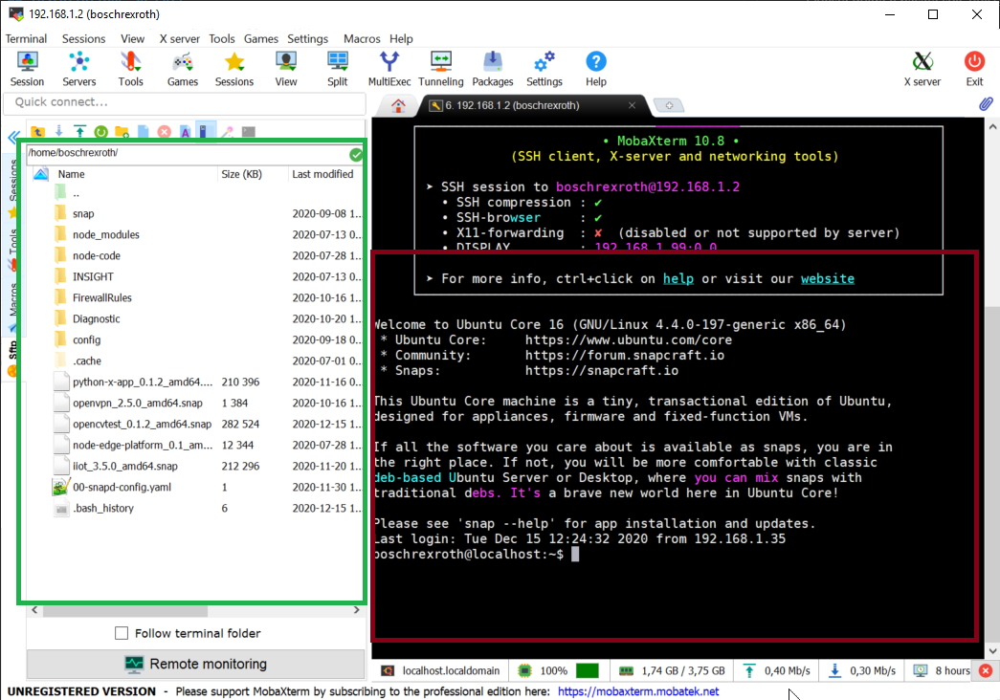

## Installazione su App PR21

### Prerequisiti
Questa guida è basata sull' utilizzo del dispositivo mediante l'applicativo 
[MobaXterm](https://mobaxterm.mobatek.net/). 
[MobaXterm](https://mobaxterm.mobatek.net/). 

### Utilizzo Mobaxterm
Aprire Mobaxterm, Aprire una nuova sessione e inserire l'ip de dispositivo e *boschrexroth* come username. Verrà richesta una password, la password di default è
*boschrexroth*.

Sulla sinistra il programma mostra un *"file explorer"* nel quale possiamo trascinare la nostra app con estensione *"_amd64.snap"* per inserirla nella memoria interna. 

### Installazione / Comandi
L'applicazione di solito fornisce già autonomamente le informazioni necessarie per il suo utilizzo di base.

    Installazione applicazione:    
    sudo snap install nomeapp_versione_amd64.snap --devmode

    esempio:
    sudo snap install cpu-monitoring_0.2_amd64.snap --devmode

    Ottenere infromazioni App:
    sudo snap info nomeapp

    Riavviare App:
    sudo snap restart nomeapp

    Rimuovere App:
    sudo snap remove nomeapp

    Abilitare/Disabilitare App:
    sudo snap enable nomeapp
    sudo snap disable nomeapp

Esempio di installazione & ottenimento informazioni di base:

